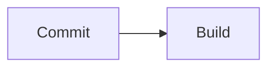
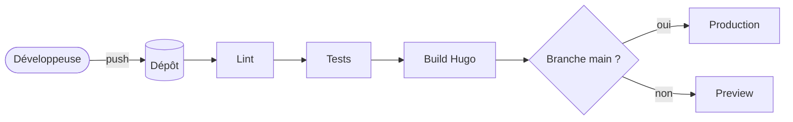
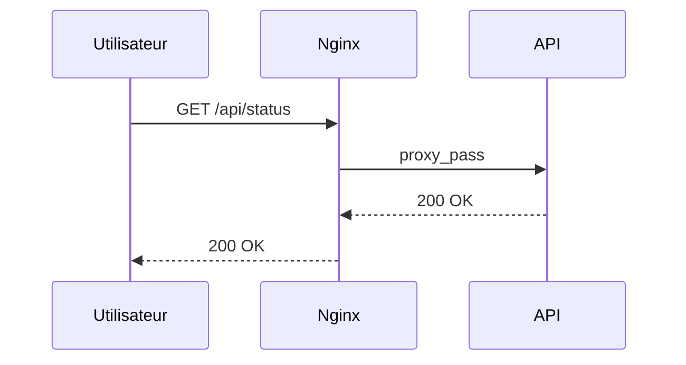

## Principe

Un bloc de code typé `mermaid` est rendu en schéma. Sans JavaScript, le code source reste affiché.

````markdown

````

## Pipeline CI/CD



## Diagramme de séquence



## Types utiles

| Mot-clé           | Usage                          |
|-------------------|--------------------------------|
| `flowchart`       | Pipelines, architectures       |
| `sequenceDiagram` | Échanges entre services        |
| `stateDiagram-v2` | Cycles de vie (déploiement…)   |
| `gitGraph`        | Stratégies de branches         |
